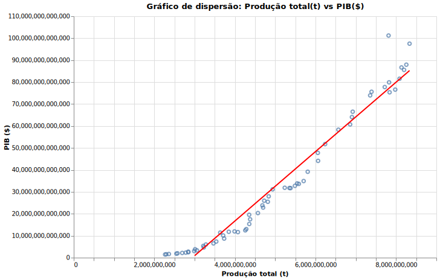
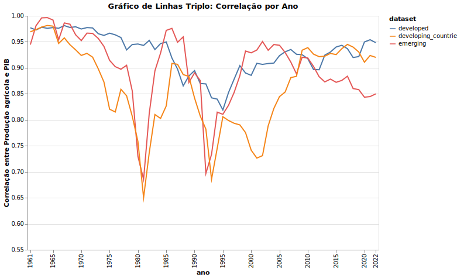
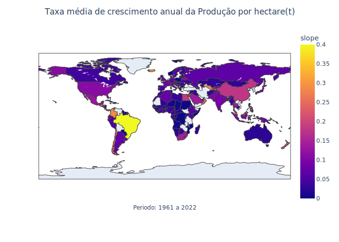
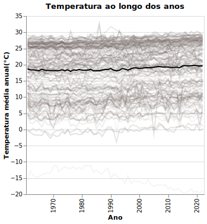

# Tema: Agricultura
- Link para visualização streamlit: https://ospinheirinhos.streamlit.app/


O objetivo deste projeto é analisar como variáveis climáticas, econômicas e de insumos agrícolas afetam a agricultura global, abrangendo o período de 1961 a 2022. Utilizamos bibliotecas como Pandas e NumPy para manipulação de dados e realizar inferências estatísticas. O foco principal é garantir a integridade dos dados para permitir análises sobre variáveis como terra arável, temperatura, precipitação, uso de insumos agrícolas (fertilizantes e pesticidas), PIB e produção agrícola, a fim de identificar correlações e tendências ao longo do tempo.

## Getting Started

### Pré-requisitos

Antes de rodar o projeto, certifique-se de ter as seguintes ferramentas instaladas:

- Python 3.12 ou superior
- pip (Python package manager)

### Instalação

1. Clone o repositório do GitHub:
   ```
   git clone arturvidalkrause/os_pinheirinhos
   ```

2. Acesse a pasta do projeto:
   ```
   cd os_pinheirinhos
   ```

3. Instale as dependências:
   ```
   pip install -r requirements.txt
   ```

4. Rode a aplicação (se houver um dashboard ou algo similar):
   ```
   streamlit run pagina_inicial.py
   ```

## Resultados Visuais e Análises Gráficas

Nesta seção, apresentamos uma série de gráficos gerados para analisar a relação entre as variáveis climáticas, econômicas e de insumos agrícolas. Os gráficos abaixo ajudam a visualizar as correlações e tendências que foram identificadas ao longo do período de 1961 a 2022.


*Figura 1: Grafico de dispesão que compara Produção total(t) de todos os paises com o PIB($)*

<br>


*Figura 2: Compara a correlação entre Produção agrícola total(t) e PIB($) dos paises em desenvolvimento, emergentes e desenvolvidos ano a ano (1961 - 2022)*

<br>


*Figura 3: Compara a taxa média do crescimento anual da produção por hectare(t) dos paises*


<br>

<div style="text-align: center;">
    
</div>

*Figura 3: Compara a média da temperatura anual dos paises ano a ano (1961 - 2022)*

## Estrutura do Projeto

- **`config.py`**: Define variáveis e parâmetros globais, como configurações de leitura de dados e caminhos dos arquivos.
- **`data/`**: Contém os datasets utilizados no projeto. Esses dados incluem variáveis climáticas, econômicas e agrícolas, como PIB, produção agrícola, fertilizantes, pesticidas e emissões de CO2.
- **`docs/`**: Diretório onde está armazenada a documentação do projeto, contendo explicações sobre o código, manuais, gráficos gerados e qualquer relatório adicional.
- **`Pages/`**: Contém as diferentes páginas ou visualizações utilizadas no projeto, sugerindo que seja um dashboard ou aplicação com várias telas.
- **`pagina_inicial.py`**: Responsável pela página inicial da aplicação, exibindo uma visão geral dos dados e análises mais importantes.
- **`readme.md`**: Este arquivo README contém todas as informações sobre o projeto, sua estrutura e instruções de uso.
- **`requirements.txt`**: Lista as bibliotecas e dependências necessárias para a execução do projeto. Facilita a instalação do ambiente de desenvolvimento.
- **`src/`**: Diretório principal do código-fonte. Aqui estão scripts para pré-processamento dos dados, análise estatística e geração de visualizações.
- **`.gitignore`**: Define quais arquivos e pastas devem ser ignorados pelo Git, como arquivos temporários ou dados sensíveis.

## Datasets Utilizados:

- **Arable Land (% of land area)**  
  Proporção de terra arável em relação à área total de cada país, um indicador importante para o potencial agrícola.  
  **Fonte**: [WorldBank](https://data.worldbank.org/indicator/AG.LND.ARBL.ZS)

- **Temperature (GHCN)**  
  Dados mensais históricos de temperatura de estações meteorológicas, usados para estudar mudanças climáticas.  
  **Fonte**: [NOAA](https://www.ncei.noaa.gov/products/land-based-station/global-historical-climatology-network-monthly)

- **Precipitação Agro**  
  Dados históricos e projetados sobre precipitação, focando nos impactos agrícolas.  
  **Fonte**: [WorldBank](https://climateknowledgeportal.worldbank.org/download-data)

- **Production Indices**  
  Índices de produção agrícola, medindo a variação no volume de produção ao longo do tempo.  
  **Fonte**: [FAOSTAT](https://www.fao.org/faostat/en/#data/QI)

- **PIB**  
  Produto Interno Bruto (PIB) de países, medido em dólares correntes, usado para avaliar o desempenho econômico.  
  **Fonte**: [WorldBank](https://data.worldbank.org/indicator/NY.GDP.MKTP.CD)

- **Fertilizantes por Nutrientes**  
  Quantidade de fertilizantes usados por tipo de nutriente.  
  **Fonte**: [FAOSTAT](https://www.fao.org/faostat/en/#data/RFN)

- **Pesticidas**  
  Uso de pesticidas agrícolas por categoria (herbicidas, inseticidas, etc.) ao longo dos anos.  
  **Fonte**: [FAOSTAT](https://www.fao.org/faostat/en/#data/RP)

- **Emissões de CO2**  
  Dados de emissões de CO2 em diferentes países, cobrindo o período desde 1750.  
  **Fonte**: [Our World in Data](https://ourworldindata.org/co2-emissions)

## Hipóteses Propostas:

- Hipótese 1: A produtividade agrícola por hectare está aumentando ao longo do tempo, com maior destaque para os países emergentes.
- Hipótese 2: Existe uma correlação significativa entre a variação de temperatura e a produção agrícola nos países em desenvolvimento.
- Hipótese 3: O aumento no uso de fertilizantes e pesticidas está diretamente correlacionado com a produção por hectare, especialmente em países subdesenvolvidos.
- Hipótese 4: A variação na precipitação ao longo dos anos impacta diretamente os índices de produção agrícola em regiões específicas.
- Hipótese 5: A produção agrícola tem uma correlação mais forte com o PIB em países subdesenvolvidos/em desenvolvimento em comparação com os países desenvolvidos.

## Pré-processamento dos Dados

No pré-processamento, foram adotadas as seguintes etapas:

1. **Tratamento de Valores Ausentes**: Utilizamos a média dos períodos anterior e posterior para preencher valores ausentes em séries temporais de temperatura e precipitação.
2. **Conversão de Tipos de Dados**: Garantimos que todas as variáveis estivessem no formato correto, unificando as unidades e corrigindo erros de arredondamento.
3. **Agregação por País**: Normalizamos os nomes dos países e utilizamos códigos ISO de três dígitos para consistência.
4. **Integração de Fontes**: As diferentes bases de dados foram integradas de forma padronizada, possibilitando uma análise coesa entre os países.
5. **Padronização Temporal**: Preenchimento de lacunas de dados de 1961 a 2022 com valores nulos (NaN) para garantir a integridade da análise temporal.

## Resultados da Análise Exploratória

A análise exploratória revelou padrões importantes, como:

- **Correlação entre Clima e Agricultura**: A variação de temperatura e precipitação está fortemente correlacionada com a produção agrícola em regiões vulneráveis, especialmente em países subdesenvolvidos.
- **Impacto dos Insumos**: O uso de fertilizantes e pesticidas apresenta uma relação direta com o aumento da produtividade agrícola, especialmente em países emergentes.
- **Produtividade por Hectare**: A produtividade por hectare aumentou ao longo do tempo em países com mais investimentos em tecnologia agrícola e insumos.

## Validação das Hipóteses

- **Hipótese 1**: Validada. A produtividade agrícola por hectare tem aumentado ao longo do tempo, com maior destaque em países emergentes.
- **Hipótese 2**: Parcialmente validada. A variação climática afeta significativamente a produção agrícola, mas a magnitude varia entre os países em desenvolvimento.
- **Hipótese 3**: Validada. O uso de insumos, como fertilizantes e pesticidas, está diretamente relacionado ao aumento de produtividade agrícola.
- **Hipótese 4**: Validada. A precipitação tem um impacto claro sobre a produção agrícola em regiões específicas.
- **Hipótese 5**: Validada. Existe uma correlação mais forte entre a produção agrícola e o PIB em países subdesenvolvidos.

## Desafios Encontrados

- **Unificação de Dados**: A diversidade de fontes de dados e a falta de uniformidade nas unidades de medida e formatos foi um grande desafio.
- **Valores Ausentes**: A ausência de dados em alguns anos e países demandou o uso de técnicas de preenchimento e análise cuidadosa.
- **Complexidade da Análise**: Devido à grande quantidade de variáveis e países analisados, foi necessário adotar técnicas avançadas de agrupamento e normalização.

## Contribuições

- **Bruno**: Tratamento dos dados e pré-processamento; Validação das hipóteses; Escrita do Artigo.
- **Artur**: Documentação dos módulos e funções; Suporte no Tratamento e processamento dos dados; Validação das hipóteses;
- **Gustavo**: Implementação do Streamlit; 
- **Kauan**: Testes unitários e validação do código.
- **Gabriel**: Testes unitários e suporte no desenvolvimento da documentação.
